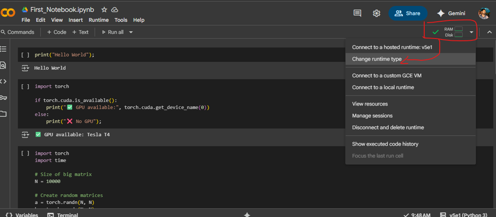
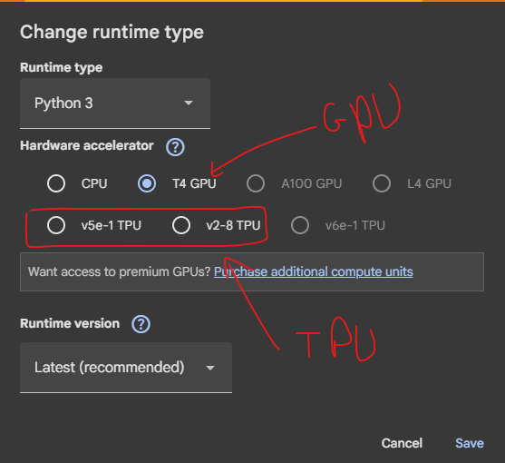

### 🎮 GPU (Graphics Processing Unit)

* Originally made for **gaming graphics** (rendering images fast).
* Has **thousands of small cores** → perfect for doing many operations **in parallel**.
* Great for:

  * Deep Learning training (matrix multiplications, tensor ops).
  * Scientific computing, simulations.
  * Video rendering.
* Example: **NVIDIA Tesla T4, V100, A100** (used in Colab).

Think of CPU as a **sharp worker doing tasks one by one**, GPU as a **huge crowd of workers doing repetitive tasks together**.

---

### 🤖 TPU (Tensor Processing Unit)

* Google’s own chip, **custom-built for AI / ML**, especially **TensorFlow**.
* Even more specialized than GPU → super fast for tensor math.
* **Not general-purpose**: can’t run arbitrary code well, but for neural nets (matrix/tensor ops) it’s blazing fast.
* Used heavily in Google Search, Translate, Gmail AI.
* Available in Colab too.

👉 Simple analogy:

* **CPU** = Swiss army knife (does everything, but slower for big jobs).
* **GPU** = Factory of workers (mass parallel power).
* **TPU** = Robot factory built for just one job: deep learning.

**tiny code** that compares CPU vs GPU speed in Colab.  
first change runtime type to available GPU from CPU  
##### Preview:  
  
  
```python
import torch
import time

# Size of big matrix
N = 10000  

# Create random matrices
a = torch.randn(N, N)
b = torch.randn(N, N)

# CPU multiplication
start = time.time()
c_cpu = torch.matmul(a, b)
end = time.time()
print("CPU Time:", end - start, "seconds")

# Move tensors to GPU (if available)
if torch.cuda.is_available():
    a_gpu = a.cuda()
    b_gpu = b.cuda()

    torch.cuda.synchronize()  # sync before timing
    start = time.time()
    c_gpu = torch.matmul(a_gpu, b_gpu)
    torch.cuda.synchronize()
    end = time.time()
    print("GPU Time:", end - start, "seconds")

    print("✅ GPU Name:", torch.cuda.get_device_name(0))
else:
    print("❌ No GPU found");
```  
#### Output:  
```console
CPU Time: 24.70375084877014 seconds
GPU Time: 0.6376545429229736 seconds
✅ GPU Name: Tesla T4
```  
Go to Runtime → Change runtime type → Hardware accelerator → TPU  
```python
import torch
import torch_xla
import torch_xla.core.xla_model as xm
import time

# Matrix size
N = 10000  

# Get TPU device
device = xm.xla_device()

# Create random matrices on TPU
a = torch.randn(N, N, device=device)
b = torch.randn(N, N, device=device)

# Warmup (first call is slow, so ignore)
_ = torch.matmul(a, b)

# Actual timing
xm.mark_step()
start = time.time()
c_tpu = torch.matmul(a, b)
xm.mark_step()
end = time.time()

print("TPU Time:", end - start, "seconds");
```  
#### Output:  
```console
TPU Time: 0.6149282455444336 seconds
```  