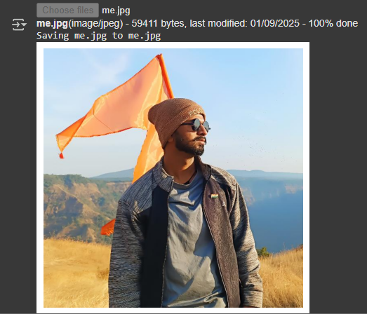
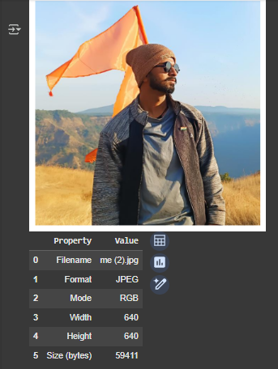
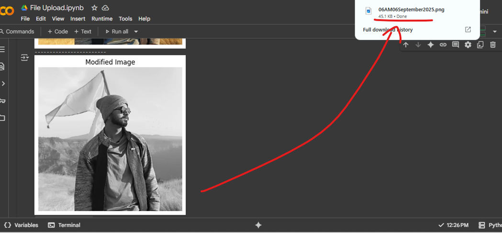

## Image Upload
### Basic Image upload  
```python
from google.colab import files
from PIL import Image
import matplotlib.pyplot as plt

# Upload image
uploaded = files.upload()  # opens file chooser

# Get the first uploaded file name
img_path = next(iter(uploaded))

# Open and display
img = Image.open(img_path)
plt.imshow(img)
plt.axis('off')  # hide axes
plt.show();
```  
##### Preview:  
  
### Image upload & tabular data
```python
from google.colab import files
from PIL import Image
import pandas as pd
import io
import matplotlib.pyplot as plt

# 1️⃣ Upload image
uploaded = files.upload()
img_name = next(iter(uploaded))  # get the first file name

# 2️⃣ Open image from bytes
img = Image.open(io.BytesIO(uploaded[img_name]))

# 3️⃣ Preview image
plt.imshow(img)
plt.axis('off')
plt.show()

# 4️⃣ Gather image info
info = {
    "Property": ["Filename", "Format", "Mode", "Width", "Height", "Size (bytes)"],
    "Value": [
        img_name,
        img.format,
        img.mode,
        img.width,
        img.height,
        len(uploaded[img_name])  # actual size in bytes
    ]
}

# 5️⃣ Display info as table
df = pd.DataFrame(info)
df
```  
##### Preview:  
  
### Changing image & download it.  
```python
from google.colab import files
from PIL import Image, ImageOps
import io
import matplotlib.pyplot as plt
import ipywidgets as widgets
from IPython.display import display
from datetime import datetime

# 1️⃣ Upload image
uploaded = files.upload()
img_name = next(iter(uploaded))
img = Image.open(io.BytesIO(uploaded[img_name]))

# 2️⃣ Preview original image
plt.imshow(img)
plt.axis('off')
plt.title("Original Image")
plt.show()

print("------------------------")

# 3️⃣ Modify image (example: grayscale + resize)
modified_img = ImageOps.grayscale(img)
modified_img = modified_img.resize((img.width//2, img.height//2))

# 4️⃣ Preview modified image
plt.imshow(modified_img, cmap='gray')
plt.axis('off')
plt.title("Modified Image")
plt.show()

# 5️⃣ Generate date-time based filename
dt_string = datetime.now().strftime("%I%p%d%B%Y")  # e.g., 12PM07July2025
save_name = f"modified_{dt_string}.png"
modified_img.save(save_name)

# 6️⃣ Control auto/manual download
auto_download = False  # Set True for automatic download, False for manual button

if auto_download:
    files.download(save_name)
else:
    # Create manual download button
    button = widgets.Button(description="Download Image")
    output = widgets.Output()

    def on_button_click(b):
        with output:
            files.download(save_name)
    
    button.on_click(on_button_click)
    display(button, output)
```  
##### Preview:  
  